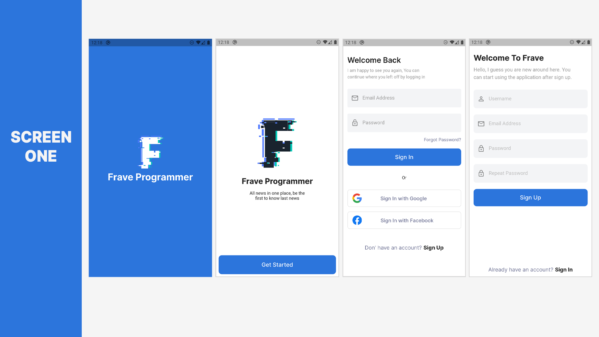
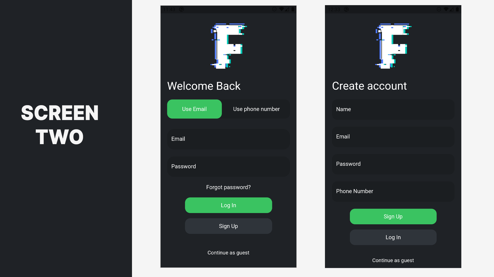
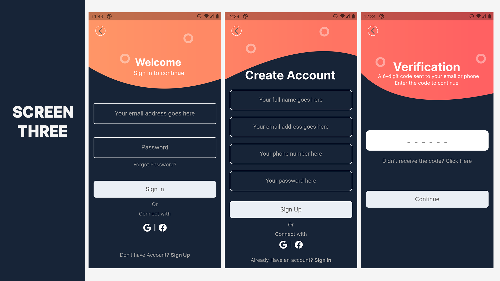
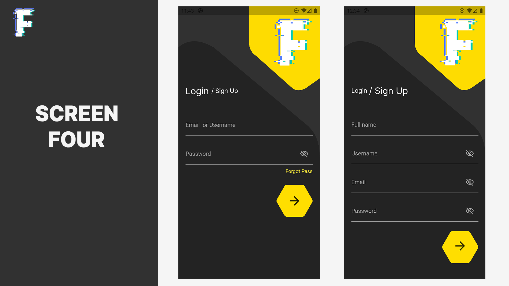
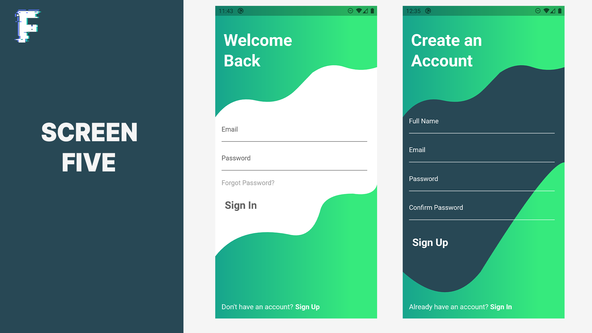
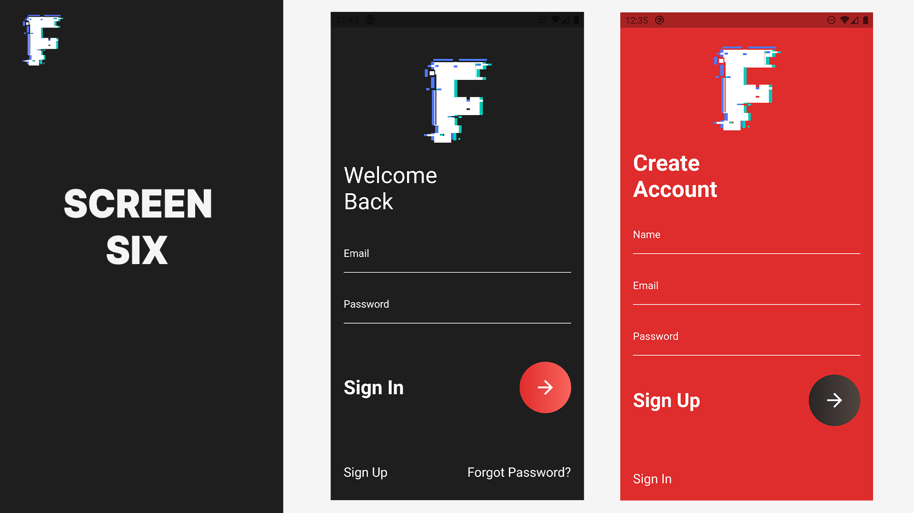
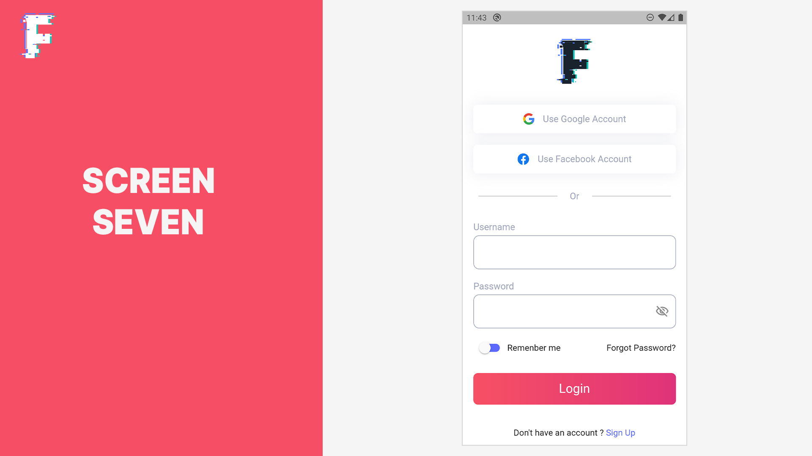
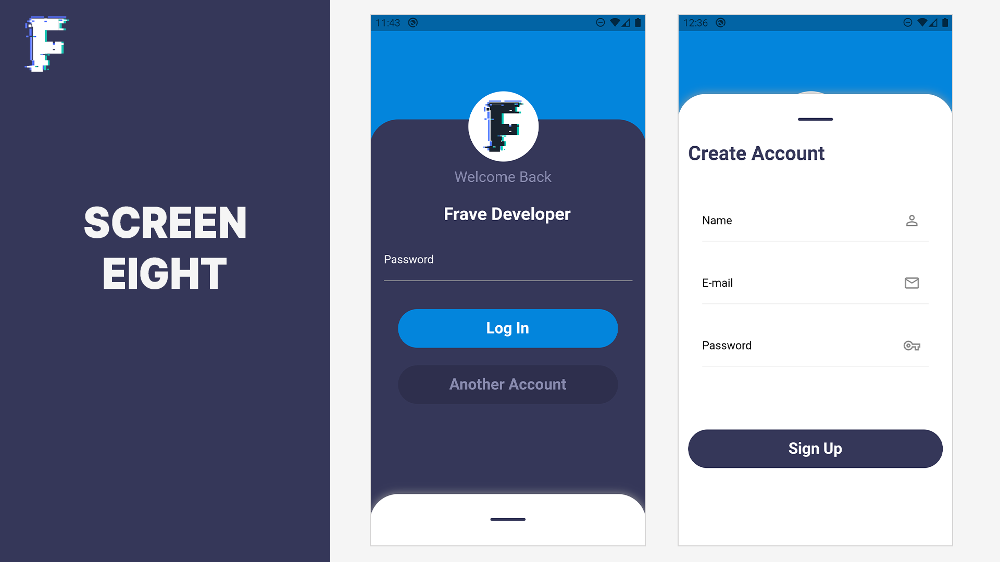
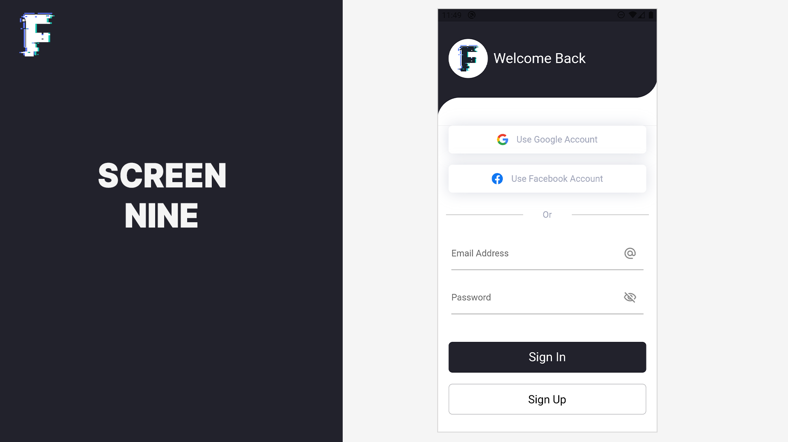
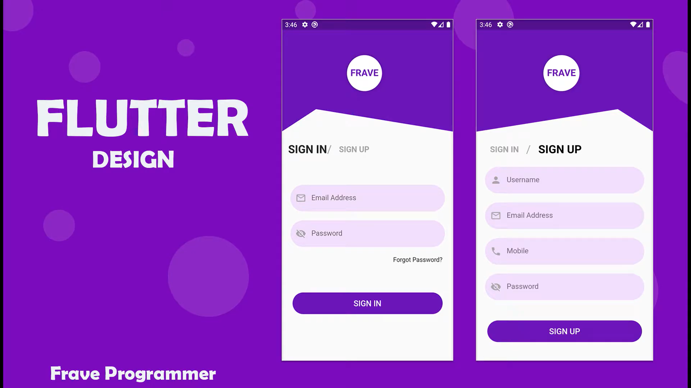

# SCREENS LOGIN UI | FLUTTER

Frave Developer

## Screenshots

### Login One

### Login Two

### Login Three

### Login Four

### Login Five

### Login Six

### Login Seven

### Login Eight

### Login Nine

### Login Ten

<td>
